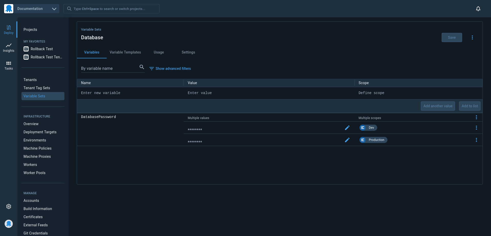

# Octopus Variable Spreader

A limitation when serializing a space to a Terraform module with octoterra is that sensitive variables are not exposed via the API, meaning there is no way to extract and embed sensitive variables in the Terraform module. 

A common workaround to this limitation is to embed an Octostache variable template as the default value for a sensitive variable. For example:

```hcl
variable "my_secret" {
  type = string
  default = "#{MySecretVariable}"
}
```

When Octopus deploys this Terraform module it can replace the Octostache template with the value of the sensitive variable.

However, this means that all sensitive variables must be able to be read via a unique variable name. If a sensitive variable is scoped in any way it may not be available to be passed to the Terraform module. This typically manifests as many sensitive variables with unique environment scopes sharing the same name, which is presented in the UI as a single variable with many values.

This tool will spread such variables so that each sensitive variable has a unique name, while recreating the original grouped variable as text variables using Octostache templates to reference the new uniquely named variables.

## Example

Imagine you have a library variable set like this, with two variables scoped to different environments and assigned the same name of `DatabasePassword`:



There is no way for the value of both secret variables made available to a step deploying a Terraform module. We need to spread these variables so that each sensitive variable has a unique name, while retaining the original variable called `DatabasePassword` with the original scopes.

Running this tool against the library variable set results in these variables:


The variables originally sharing the name of `DatabasePassword` have been spread into two variables called `DatabasePassword_Environments-381` and `DatabasePassword_Environments-881`. The suffix on the end of the variables indicates their original scopes, and in this example the `Dev` environment had an ID of `Environments-381` while the `Production` environment had an ID of `Environments-881`.

The variable called `DatabasePassword` has been updated to reference the values of these new secret variables while retaining the original variable scopes. Because variables are resolved transitively, the eventual value of the `DatabasePassword` variable is the same as it was before.

By spreading the secret variables into their own uniquely named variables and removing their scope, the values of these secret variables can be injected into the Terraform module when it is deployed.

## Security implications

The new secret variables are unscoped, meaning their values can be made available in any deployment. This can present a risk if you used environment scopes as a way to exclude secrets from certain environments, tenants, deployment processes etc.